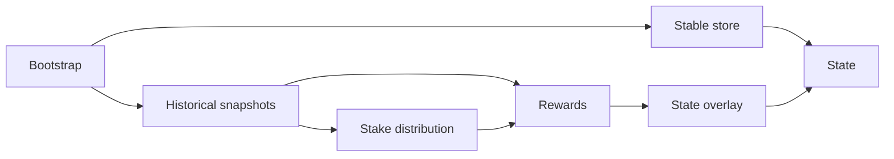
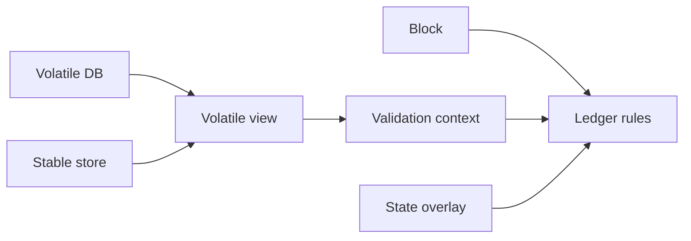
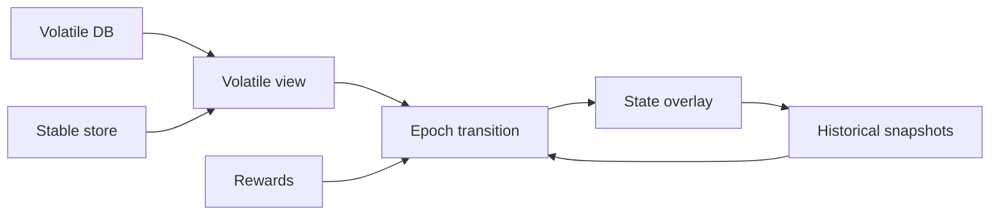

# Amaru Ledger

`amaru-ledger` is the ledger engine used by Amaru. Its job is to validate block bodies and transactions against a Cardano ledger view, maintain the evolving ledger state for a chain candidate, and materialize the derived views that other parts of the node need at validation and epoch boundaries.

The crate is deliberately not a chain database. It does not try to preserve full block history as its primary data model. Once a block has been validated and its effects have been absorbed into ledger state, long-term block storage belongs elsewhere.

## Responsibility

At a high level, the crate owns five related responsibilities:

- Maintain a rollback-capable ledger state for a candidate chain.
- Validate block bodies and standalone transactions, including phase one and phase two checks.
- Track delayed ledger effects that only become active later, such as rewards, governance ratification, protocol parameter changes, and pool updates.
- Produce derived summaries such as stake distributions, rewards inputs, and governance views.
- Expose consensus-facing adapters and query surfaces over the current ledger view.

The central runtime type is [`State<S, HS>`](src/state.rs). It combines:

- A stable store of finalized ledger state.
- A volatile in-memory window of the latest block-level diffs.
- An overlay for information that already matters for validation but is not yet stable enough to persist.
- Historical snapshots needed for rewards, governance, and stake-distribution work.

## Architecture

The runtime dataflow is intentionally split into small layers instead of centering everything around a single monolithic state structure:

### State Initialisation (from snapshots)

### Block Validations

### Epoch Transitions

### Module map

- [`src/state.rs`](src/state.rs), [`src/state/`](src/state): the main ledger runtime. This is where stable state, volatile diffs, overlay state, rollback, persistence, and epoch transitions are orchestrated.
- [`src/state/volatile.rs`](src/state/volatile.rs), [`src/state/volatile/`](src/state/volatile): the volatile-state subsystem. This now splits the in-memory unstable window into the database, view, and per-block fragment types.
- [`src/store.rs`](src/store.rs), [`src/store/`](src/store): storage traits and column layouts. The ledger logic is written against `ReadStore`, `Store`, `Snapshot`, and `HistoricalStores` rather than against a single concrete backend.
- [`src/store/epoch_transition.rs`](src/store/epoch_transition.rs): persistence helpers for epoch-boundary effects once rewards, pool updates, and governance updates are ready to be flushed to stable storage.
- [`src/context.rs`](src/context.rs), [`src/context/default/`](src/context/default): slice-based preparation and validation contexts. Ledger rules operate on traits describing the pieces of state they need instead of directly reaching into storage.
- [`src/rules/`](src/rules): ledger validation rules. This contains block-level checks plus transaction phase one and phase two execution.
- [`src/epoch_transition.rs`](src/epoch_transition.rs), [`src/epoch_transition/`](src/epoch_transition): delayed epoch-boundary logic, including rewards finalization, pool updates, and governance updates.
- [`src/governance/`](src/governance): governance ratification logic and its supporting data structures.
- [`src/summary/`](src/summary): derived summaries computed from snapshots, especially stake distribution, rewards, and governance summaries.
- [`src/block_validator.rs`](src/block_validator.rs): the adapter between ledger state and the consensus-facing traits used by the rest of the node.
- [`src/bootstrap.rs`](src/bootstrap.rs): snapshot import and initial-state bootstrap from Haskell `NewEpochState` data.

### Execution model

The normal validation path looks like this:

1. [`rules::prepare_block`](src/rules.rs) or `prepare_transaction` collects the inputs that must be resolved before validation.
2. [`State`](src/state.rs) resolves those pieces from the stable store plus the current volatile window and builds a [`DefaultValidationContext`](src/context/default/validation.rs).
3. [`rules::block::execute`](src/rules/block.rs) runs block-level checks and then validates each transaction through phase one and phase two.
4. Successful validation does not immediately mutate the stable store. Instead, the validation context accumulates a [`VolatileFragment`](src/state/volatile/fragment.rs).
5. [`State`](src/state.rs) appends that fragment to the [`VolatileDB`](src/state/volatile/db.rs), materializes a [`VolatileView`](src/state/volatile/view.rs) when needed, persists blocks that have become stable, and triggers epoch-boundary logic when the chain crosses into a new epoch.

This split is important. It keeps pure ledger-rule evaluation separate from storage concerns and from the mechanics of delayed application.

## Key Differentiators from Haskell's `cardano-node`

Compared with the Haskell node and ledger stack, `amaru-ledger` makes a few explicit design choices:

- It uses a hybrid storage model. Finalized ledger state lives in a key-value store, while only the recent unstable window is kept in memory as diffs. The Haskell implementation has historically relied heavily on large in-memory persistent data structures and structural sharing. Note that, since recently, an hybrid ledger partially storing the UTxO set on-disk is also available.
- It is snapshot-first by design. The crate assumes bootstrap from ledger snapshots and historical snapshots for epoch work, rather than trying to solve full chain synchronization from genesis inside the ledger component itself.
- It keeps storage, rule evaluation, and consensus integration as separate layers. `Store` traits, slice-based contexts, summaries, and the `BlockValidator` adapter are all first-class boundaries in the code.
- A single `State` value is intentionally linear: it tracks one candidate chain. Multiple candidates can share the same stable backend while maintaining their own volatile views. This differs from representing every branch as one large shared in-memory structure.
- Delayed epoch state is modeled explicitly through [`StateOverlay`](src/state/overlay.rs), rather than being implicit in one globally updated structure. This makes the boundary between "already relevant for validation" and "stable enough to persist" visible in the code.

These choices are mostly about operational trade-offs: memory footprint, restart behavior, persistence boundaries, and keeping the ledger core testable in isolation.

## Current TODOs And Disclaimers

> [!WARNING]
> This crate already contains the core shape of the Amaru ledger, but it should not be read as production-ready yet. The items below are material remaining work, not minor cleanup.

- Rewards computation and some epoch-boundary work are still synchronous. The code already marks rewards calculation as work that likely needs asynchronous or background execution.
- Restart currently assumes an empty volatile window. On restart, consensus is expected to replay the last `k` blocks; durable recovery of the volatile state is not implemented yet.
- Snapshot bootstrap is intentionally narrow. [`bootstrap`](src/bootstrap.rs) partially decodes Haskell `NewEpochState`, assumes end-of-epoch snapshots, and still rejects some unsupported governance scenarios with hard assertions.
- Some epoch-boundary accounting is still incomplete, including volatile account deregistrations, unbinding accounts from retired pools, pool-deposit handling, and parts of governance-related voting stake accounting.
- Governance ratification currently collects all votes in memory before processing them. That is serviceable for now, but it is not the final operational shape for large or adversarial inputs.
- Context preparation is still incomplete beyond the UTxO path, and some rule code still carries technical debt around script handling, batching, data representation, and error shaping.
- The performance story is not settled yet. We still need disciplined measurement of end-to-end block validation latency, volatile memory footprint, snapshot costs, and restart or replay behavior.
- Conformance and test coverage continue to grow, but some branches in rules and epoch-transition code are still explicitly marked as missing coverage or needing refactors.

Until those items are addressed, this README should be read as a description of the intended architecture and the parts already implemented, not as a claim that the crate is feature-complete or operationally finished.
